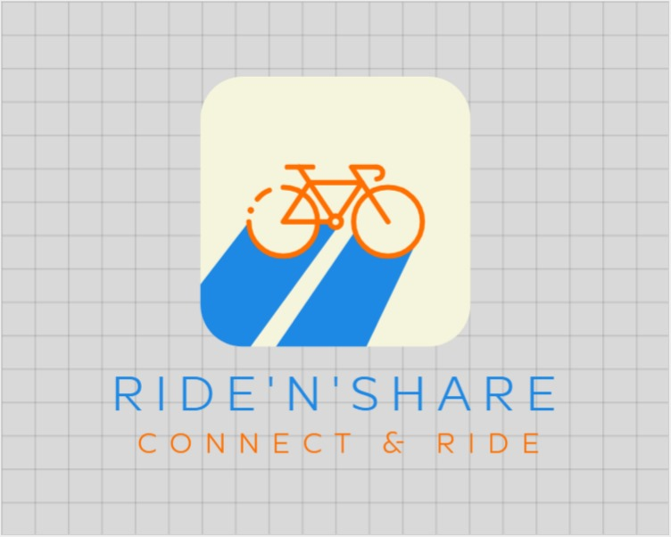
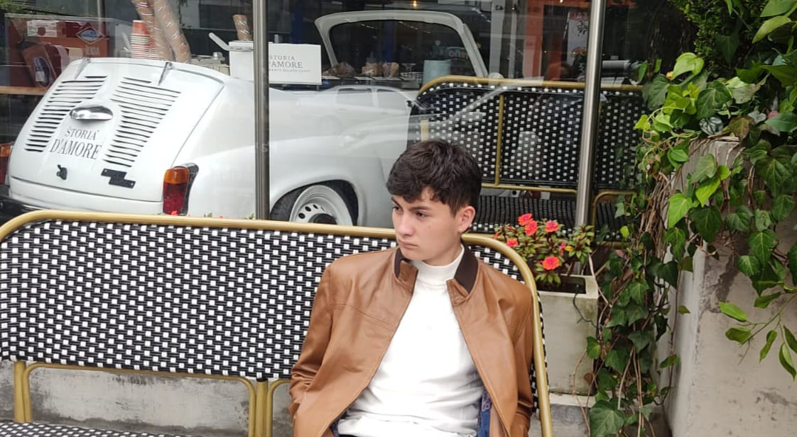
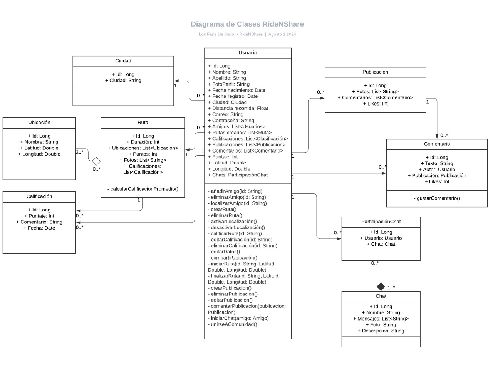

# Los Fans de Oscar

 

## RideNShare

### Descripción
RideNShare es una innovadora aplicación de red social diseñada específicamente para ciclistas que desean compartir sus rutas y ubicaciones con amigos. Esta plataforma intuitiva y fácil de usar permite a los usuarios conectar con otros ciclistas, descubrir nuevas rutas, y compartir sus experiencias en tiempo real.

### Objetivo

El objetivo de RideNShare es proporcionar a los ciclistas una plataforma que no solo mejore su experiencia de ciclismo, sino que también fortalezca la comunidad ciclista. Al facilitar la compartición de rutas y ubicaciones, RideNShare aspira a hacer del ciclismo una actividad más social, segura y accesible para todos.

### Lean Canvas

.png)

---

## Integrantes

| Foto | Nombre | Mini Biografía |
|------|--------|----------------|
|  | **Alejandro Barragan** | Estudiante de Ingeniería de Sistemas y Ciencia de Datos, me gusta mucho el desarrollo de SW y la analítica de datos. Me gusta jugar rugby, ir al gimnasio y salir de fiesta. Mi rol en el proyecto es la construcción del backend de la aplicación.|
|  | **Daniel Carvajal** | Estudiante de Ingeniería de Sistemas, enfocado en la gestión de proyectos y seguridad. Principales aficiones los deportes y las actividades sociales. Mi rol en el equipo es  Planear, Organizar y Dirigir y Controlar las actividades, tiempo y entregas del equipo. Siendo tambien el CEO de RideNShare.|
|  | **Nicolas Ramirez** | Estudiante de Ingeniería de Sistemas, no me gusta casi el desarrollo de SW por lo contrario gerencia de proyectos. Disfruto hacer ejercicio y salir con mis amigos, soy Piloto profesional de automovilismo y mi rol en el equipo es realizar el frontend de la aplicación y la gestión del trabajo para que este se realice de manera satisfactoria. |
---

## Sección de Entregables

### 1. Diagrama de Clases Inicial del Proyecto

 

---

### 2. Pantallas Principales de la Aplicación

#### Pantalla 1: Nombre de la Pantalla

Los mockups de las pantallas principales del proyecto están disponibles en el siguiente enlace:

[Ver Mockups](https://www.figma.com/design/qiUq9XTLhZme5YOusIgsjf/Mockups-Ride'N'Share?node-id=18-47&t=hVNRs5D9tMyc8ShS-1)
---

## Notas Adicionales

- **README.md:** No olvidar actualizar este documento con cualquier cambio en el proyecto.
- Incluir cualquier otra información relevante para el proyecto.

---

© 2024 - RideNShare. Todos los derechos reservados.
